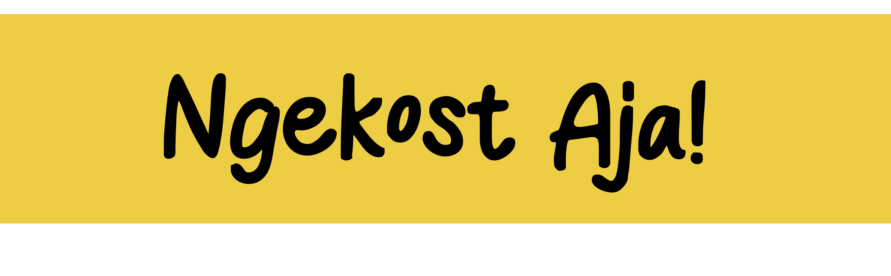

    

# Deskripsi
Proyek ini terinspirasi oleh aktivitas sehari-hari mahasiswa, yaitu **"Ngekost"**. Hampir setiap mahasiswa pernah mengalami yang namanya ngekost. Dari situ kami terpikirkan bagaimana jika kami buat sebuah sistem sendiri untuk mengurusi kost-kostan 🤔. Tanpa basa-basi, mari kami eksekusi proyek ini✊🏻.

Implementasi dari sistem yang dibuat adalah dengan menggunakan website 🌐sebagai media yang bisa mempertemukan antara pihak mahasiswa sebagai pencari kost dengan penyedia usaha kost-kostan. Pilihan media ke website akan lebih memudahkan pengguna dalam mengakses sistem. Selain itu, website jauh lebih mudah untuk dikembangkan daripada media lain seperti aplikasi mobile Android 📱. 

Proses pembuatan proyek ini membutuhkan waktu yang cukup lama karena proyek ini kami jadikan juga sebagai wadah untuk bereksperimen dan belajar dalam pembuatan website. Ini karena pada saat pengembangan proyek ini, kami masih benar-benar baru dalam mengembangkan sebuah perangkat lunak khususnya website. Trial dan error sudah pasti dilalui selama pengembangan website.

# Pengguna Sistem
Pengguna dari sistem ini cukup banyak. Perencanaan pengguna yang bakal menggunakan sistem ini didasarkan pada hasil pengamatan dari usaha kost-kostan yang ada di sekitar kami.
1. Mahasiswa 🧑🏻‍🎓

    Pengguna utama sistem. Memiliki hak untuk menyewa kost-kostan dan melakukan negosiasi dengan pengelola kost-kostan.

2. Pengelola usaha kost-kostan 🤵🏻‍♀️

    Pihak yang mengelola kost-kostan di area tertentu. Dia akan berperan untuk mengurusi segala transaksi yang bakal terjadi dengan mahasiswa (pengelola) dan melaporkannya ke pemilik kost-kostan. Pihak pengelola bisa dari pemilik kost itu sendiri atau pihak lain yang direkrut oleh pemilik usaha kost-kostan. 

3. Pemilik usaha kost-kostan 👱🏻

    Pemilik di sini seseorang yang memiliki aset usaha kost-kostan. Dia bisa mengelola aset yang dia miliki dan bisa memantau langsung aktivitas yang dilakukan pada cabang kost yang dia miliki.

# Fitur
Penjelasan fitur akan terbagi ke dalam jenis-jenis pengguna yang sudah disebutkan sebelumnya. Namun, ada juga beberapa fitur umum yang dimiliki oleh beberapa pengguna sekaligus. Berikut rincian fitur yang bakal ada di sistem:
1. Umum
    - Autentikasi dan otorisasi
1. Mahasiswa
    - Lorem ipsum
    - Lorem ipsum
    - ...
2. Pengelola
    - Lorem ipsum
    - Lorem ipsum
    - ...
3. Pemilik
    - Lorem ipsum
    - Lorem ipsum
    - ...

---
---
